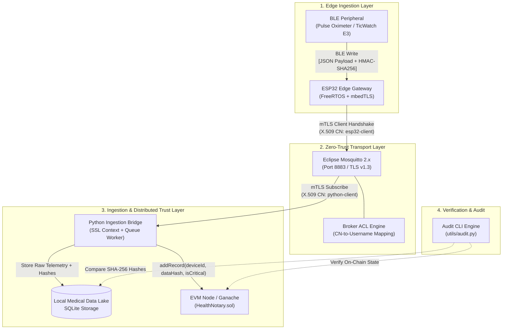
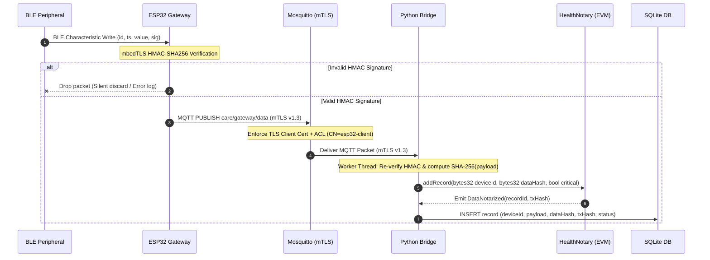
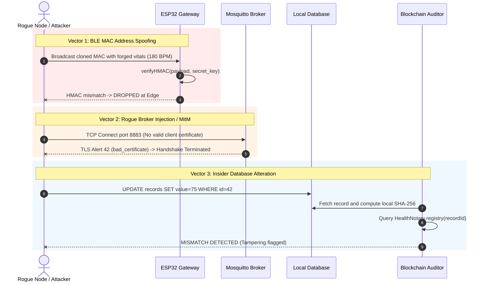

# Secure IoT Healthcare Architecture
### Zero-Trust mTLS v1.3 Hardening, Source HMAC Verification & EVM Notarization

[](LICENSE)
[](https://en.wikipedia.org/wiki/Mutual_authentication)
[](https://www.espressif.com/)
[](https://soliditylang.org/)
[](https://mosquitto.org/)

An end-to-end telemetry ingestion architecture for biomedical IoT edge devices, engineered to eliminate single points of compromise across the transport, processing, and persistence tiers. Developed within research on assistive robotic frameworks (PNRR **Age-IT**), this system enforces mutual identity verification, payload source authenticity, topic-level access control, and cryptographic non-repudiation.

---

## Architecture Specification

The system implements a three-tier defense model: Edge Gateway, Message Broker with Mutual TLS, and Decentralized Persistence.



---

## Data Flow & Ingestion Pipeline



---

## Threat Model & Attack Analysis

Standard healthcare gateways rely on MAC filtering for BLE peripherals and unauthenticated MQTT connections over plaintext or server-only TLS. This architecture addresses four specific attack vectors evaluated via a Proof-of-Concept (PoC) harness.



### Defense Matrix

| Threat Vector | Attack Mechanism | Unhardened Baseline | Implemented Defense |
| :--- | :--- | :---: | :--- |
| **BLE MAC Spoofing** | Rogue board broadcasts valid sensor MAC with forged payload | Ingested blindly | **HMAC-SHA256**: Packets without cryptographic signature signed with shared key are dropped at the FreeRTOS task level. |
| **Transport Sniffing** | Promiscuous packet capture on local LAN (Wireshark) | Plaintext readable | **TLS v1.3**: Wire traffic encrypted using ephemeral ECDHE key exchange and AES-256-GCM cipher suites. |
| **Broker Impersonation** | DNS spoofing / rogue MQTT proxy | Connected & leaked | **Server Certificate Validation**: Gateway verifies broker CA chain and IP Subject Alternative Names (SAN). |
| **Rogue Ingestion Node** | Unauthorized MQTT client publishes malicious alerts | Accepted | **Mutual TLS (mTLS)**: Broker rejects connections during TLS handshake unless a valid client cert issued by the private Root CA is presented. |
| **Privilege Escalation** | Compromised client attempts publishing to admin channels | Permitted | **Broker ACL**: Least-privilege matrix maps X.509 Common Name (`CN`) directly to topic read/write permissions. |
| **Storage Tampering** | Ransomware or privileged DBA alters SQLite telemetry history | Undetected | **EVM Notarization**: Every record is anchored by its `SHA-256` digest on-chain; `utils/audit.py` detects discrepancy. |

---

## Cryptographic & Protocol Specifications

### 1. BLE Telemetry Payload Structure

Payloads are encoded as JSON and signed using HMAC-SHA256 across `deviceId + timestamp + rawValue`:

```json
{
  "id": "OXIMETER_01",
  "ts": 1726584920,
  "value": 98.6,
  "sig": "b2f69e96f1345d24b699a756612df2f7e8a93cbdf8b3d6888497d3dfa2717013"
}
```

```
Signature Input:  "OXIMETER_01" + "1726584920" + "98.6"
Signature Output: HMAC-SHA256(Input, HMAC_SECRET)
```

### 2. X.509 Public Key Infrastructure (PKI)

The infrastructure enforces a private two-tier PKI generated via `certs/generate_certs.sh`:

* **Root CA**: 4096-bit RSA self-signed certificate (`ca-cert.pem`), 3650-day validity.
* **Broker Certificate**: 2048-bit RSA (`server-cert.pem`), signed by Root CA, with Subject Alternative Name (`IP:127.0.0.1`).
* **Gateway Client Certificate**: 2048-bit RSA (`esp32-client-cert.pem`), `CN=esp32-client`.
* **Bridge Client Certificate**: 2048-bit RSA (`python-client-cert.pem`), `CN=python-client`.

### 3. Mosquitto Access Control Lists (ACL)

Defined in `docker/mosquitto.acl`:

```
# ESP32 Gateway: Publish telemetry only
user esp32-client
topic write care/gateway/data

# Python Ingestion Bridge: Subscribe to incoming telemetry
user python-client
topic read care/gateway/data
```

---

## Smart Contract Specification (`HealthNotary.sol`)

The notarization layer runs as an EVM smart contract (`blockchain/HealthNotary.sol`) compiled with `solc 0.8.19`.

### State Storage & Memory Layout

```solidity
struct Record {
    uint256 timestamp;  // Block timestamp of notarization
    bytes32 deviceId;   // Anonymized device identifier hash
    bytes32 dataHash;   // SHA-256 digest of original raw telemetry JSON
    bool critical;      // Medical triage flag (heart rate < 50 or > 120 bpm)
}
```

### Security & Compliance Controls

* **Zero Plaintext PII (GDPR Art. 9 Compliant):** No patient health data, personal identifiers, or raw biometric measurements are stored on-chain. Only cryptographic digests (`bytes32 dataHash = sha256(payload)`) and pseudonymized IDs (`bytes32 deviceId`) are recorded.
* **Anti-Replay / Collision Check:**
  ```solidity
  if (dataHashUsed[dataHash]) revert DuplicateDataHash();
  ```
  Prevents duplicate telemetry injection or replaying intercepted packets.
* **Role-Based Access Control (RBAC):** Restricts `addRecord` execution to authorized addresses managed by the contract owner via the `onlyNotarizer` modifier.

---

## Deployment & Verification Guide

### Prerequisites
* **Docker Engine** `>= 24.0` & **Docker Compose**
* **Python** `>= 3.10`
* **PlatformIO Core** or VSCode PlatformIO extension
* **Ganache CLI / Ethereum Node**

---

### Step 1: Generate Private PKI Hierarchy

Execute the automated provisioning script to generate the Root CA and issue certificates:

```bash
chmod +x certs/generate_certs.sh
./certs/generate_certs.sh 127.0.0.1
```

Generated artifacts in `certs/`:
* `ca-cert.pem`, `ca-key.pem`
* `server-cert.pem`, `server-key.pem`
* `esp32-client-cert.pem`, `esp32-client-key-rsa.pem`
* `python-client-cert.pem`, `python-client-key.pem`

---

### Step 2: Start the Hardened MQTT Broker

Launch Eclipse Mosquitto with TLS v1.3 and certificate authentication enabled:

```bash
cd docker
docker compose up -d
```

Verify broker listener status:
```bash
docker compose logs mosquitto
# Expected output: OpenSSL support: yes, TLS 1.3 enabled, listening on port 8883
```

---

### Step 3: Configure and Run Ingestion Bridge

1. Copy and configure the environment file:
   ```bash
   cp .env.example .env
   ```

2. Install Python dependencies:
   ```bash
   pip install -r backend/requirements.txt
   ```

3. Deploy `HealthNotary.sol` on Ganache / Local EVM node and update `CONTRACT_ADDRESS` in `.env`.

4. Start the ingestion service:
   ```bash
   python backend/main.py
   ```

---

### Step 4: Run the Integrity Audit CLI

Execute the tamper-verification engine to audit local database records against on-chain records:

```bash
python utils/audit.py
```

The auditor calculates `SHA-256` digests of local records, queries `HealthNotary.registry(recordId)` on the EVM, and reports verification status:
* `VALID`: Local hash matches on-chain fingerprint.
* `TAMPERED`: Hash mismatch indicates database alteration.
* `NOT_NOTARIZED`: Record not anchored on-chain.

---

### Step 5: Flash ESP32 Gateway Firmware

1. Initialize secrets configuration:
   ```bash
   cp firmware/src/secrets.cpp.example firmware/src/secrets.cpp
   ```

2. Paste generated `ca-cert.pem`, `esp32-client-cert.pem`, and `esp32-client-key-rsa.pem` contents into `firmware/src/secrets.cpp`.

3. Compile and flash using PlatformIO:
   ```bash
   cd firmware
   pio run --target upload
   ```

---

## Repository Layout

```
├── backend/
│   ├── blockchain.py         # Web3.py EVM interaction & transaction signing
│   ├── bridge.py             # Threaded MQTT client with SSL context & queue worker
│   ├── config.py             # Environment configuration (.env loader)
│   ├── database.py           # SQLite local persistence engine
│   ├── main.py               # Ingestion entrypoint
│   └── requirements.txt      # Python dependencies
├── blockchain/
│   └── HealthNotary.sol      # EVM smart contract (Solidity 0.8.19)
├── certs/
│   └── generate_certs.sh     # PKI generation automation script
├── docker/
│   ├── docker-compose.yml    # Mosquitto container specification
│   ├── mosquitto.conf        # TLS v1.3 & clientAuth broker configuration
│   └── mosquitto.acl         # CN-based least-privilege ACL rules
├── firmware/
│   ├── platformio.ini        # PlatformIO build configuration
│   ├── include/              # FreeRTOS task headers, config, secrets interface
│   └── src/                  # BLE GATT receiver, HMAC validation, mbedTLS MQTT
├── utils/
│   ├── audit.py              # CLI database vs blockchain integrity auditor
│   ├── ble_script.py         # BLE peripheral payload simulation script
│   └── permission_test.py    # MQTT ACL policy validation suite
├── .env.example              # Template environment variables
└── README.md
```

---

## License

This project is licensed under the [Apache 2.0 License](LICENSE).
