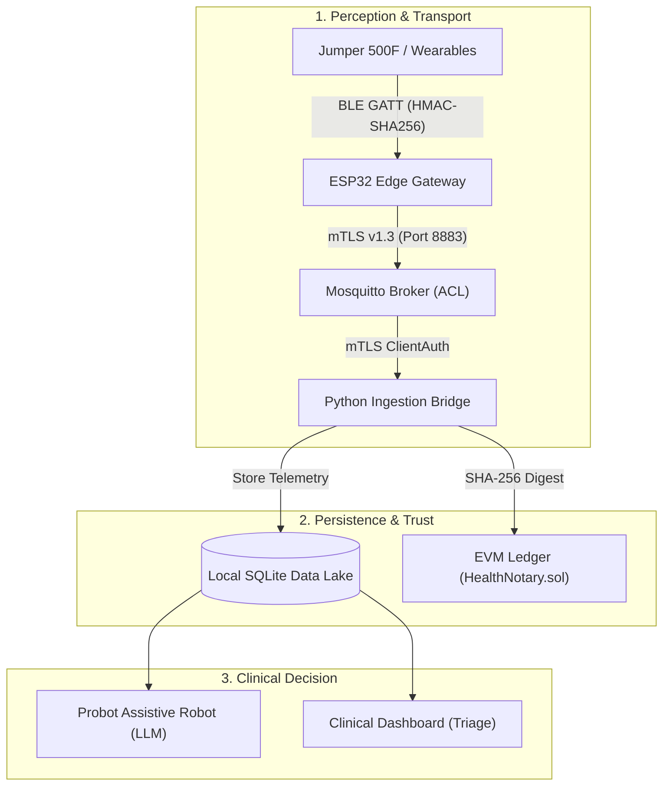
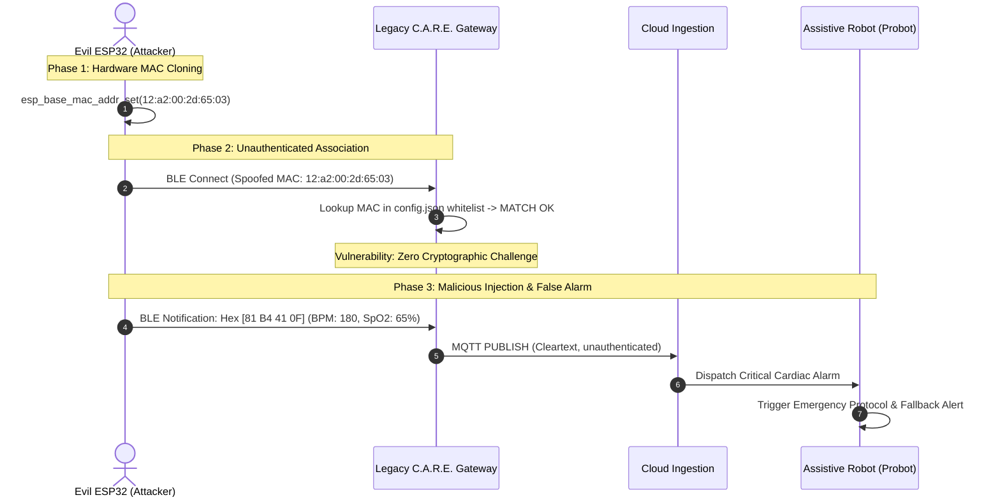
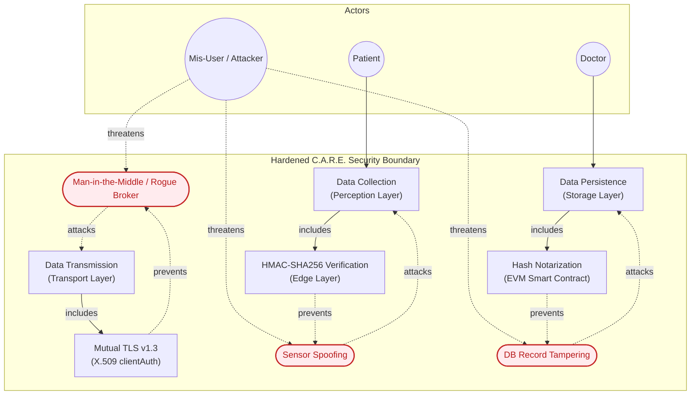
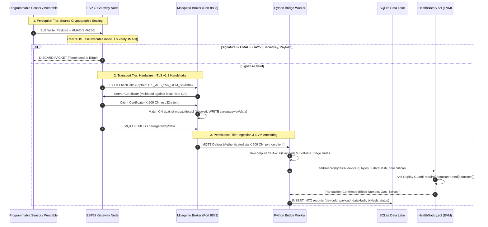

# Secure-by-Design IoT Healthcare Architecture
### Hardening the C.A.R.E. Framework through Mutual TLS (mTLS v1.3), Edge HMAC Verification, and EVM Notarization

[](LICENSE)
[](https://en.wikipedia.org/wiki/Mutual_authentication)
[](https://www.espressif.com/)
[](https://soliditylang.org/)
[](https://mosquitto.org/)
[-red?logo=adobeacrobatreader)](docs/CARE_IoT_Security_Architecture.pdf)

An end-to-end security architecture designed to eliminate hardware-level trust, identity spoofing, and clinical telemetry tampering across the **C.A.R.E. (Active Assisted Living - AAL)** framework. Developed at the **Università degli Studi di Salerno** (IoT Security & Data Security curricula), this project transitions vulnerable ambient assisted living hubs from static MAC-whitelist filtering to an authenticated Zero-Trust edge pipeline.

> [!NOTE]
> The full theoretical model, vulnerability analysis, and attack logs are detailed in the official project slide deck:  
> [📄 **docs/CARE_IoT_Security_Architecture.pdf**](docs/CARE_IoT_Security_Architecture.pdf)

---

## 1. Context: The C.A.R.E. Framework

The **C.A.R.E. Framework** monitors elderly individuals with comorbidities in home environments. It connects heterogeneous wearable medical sensors via Bluetooth Low Energy (BLE) to feed an assistive robot (**Probot**) and an LLM-driven decision-making engine responsible for:
* Proactive nutritional guidance and daily routine management.
* Therapeutic compliance and scheduled medication reminders.
* Real-time triage and emergency alert dispatch to clinical dashboards.



**The Threat Reality:** If telemetry is corrupted or spoofed at the perception layer, downstream AI models and clinical supervisors make decisions on falsified parameters, potentially triggering unneeded emergency interventions or failing to detect actual cardiac events.

---

## 2. Vulnerability Assessment & Empirical Attack (PoC)

An audit of the legacy C.A.R.E. IoT Gateway revealed two critical architectural vulnerabilities:
1. **Implicit Device Trust:** Authentication relied entirely on a static JSON MAC address whitelist (`conf/config.json`).
2. **Plaintext Transports:** Cleartext communication across both BLE advertisements/GATT notifications and MQTT message transport.

### Attack Execution: "Evil ESP32" MAC Spoofing

To quantify clinical impact, an adversary node (*"Evil ESP32"*) was programmed to clone the public MAC address of a whitelisted commercial pulse oximeter (**Jumper 500F**, MAC `12:A2:00:2D:65:03`) and inject forged vitals simulating acute cardiac arrest (`BPM: 180, SpO2: 65%`).



### Empirical Terminal Capture

```
=== Attacker Serial Monitor (Evil ESP32) ===
entry 0x400805e4
Avvio Evil ESP32 Jumper...
MAC Base impostato con successo!
MAC Address BLE Attivo: 12:a2:00:2d:65:03
In attesa del Gateway...
>> GATEWAY CONNESSO! Inizio iniezione dati...
-> Pacchetto INIETTATO: BPM=180 SpO2=65 [Hex: 81 B4 41 0F]
-> Pacchetto INIETTATO: BPM=180 SpO2=65 [Hex: 81 B4 41 0F]

=== Vulnerable Gateway Log Output ===
INFO - configuration - Successfully parsed configuration for user 0cd2a3fc-0613-4d76-b154-1d3e195efc4a
INFO - Gateway main - {'12:A2:00:2D:65:03': 'pulseoximeter'}
INFO - Pulseoximeter device - Connected to 12:A2:00:2D:65:03
INFO - Pulseoximeter device - Listening for notifications on 12:A2:00:2D:65:03
INFO - Pulseoximeter device - Data from 12:A2:00:2D:65:03 -> BPM: 180, SpO2: 65, PI: 1.5
[ALERT] Critical tachycardia detected! Propagating alarm to clinical dashboard...
```

---

## 3. Misuse Case & Architectural Countermeasures

To mitigate these flaws systematically, security requirements were mapped into a formalized Misuse Case model:



---

## 4. Hardened Security Architecture

The refactored architecture establishes a **Zero-Trust** security perimeter across every boundary:



---

## 5. Security Verification Matrix

| Vector | Attack Scenario | Traditional Gateway | Hardened C.A.R.E. Gateway |
| :--- | :--- | :---: | :--- |
| **BLE MAC Spoofing** | Evil ESP32 clones victim MAC address | ❌ Compromised | ✅ **Blocked at Edge:** Packets lacking valid pre-shared HMAC-SHA256 signature are dropped before network dispatch. |
| **Traffic Sniffing** | Promiscuous LAN capture (Wireshark) | ❌ Plaintext Exfiltration | ✅ **Blocked:** TLS v1.3 with ephemeral ECDHE key exchange and AES-256-GCM encryption. |
| **Rogue Broker MitM** | Attacker redirects DNS / IP to rogue broker | ❌ Compromised | ✅ **Blocked:** Gateway strictly validates the broker certificate against the Root CA and enforces IP SAN matching. |
| **Rogue Ingestion Node** | Malicious MQTT publisher injects false data | ❌ Compromised | ✅ **Blocked:** Broker drops connection at TLS handshake (`require_certificate true`). |
| **Topic Hijacking** | Client attempts publishing to unauthorized topics | ❌ Permitted | ✅ **Blocked by ACL:** Identity mapped to X.509 Common Name (`esp32-client` restricted to write on `care/gateway/data`). |
| **Database Tampering** | Insider or malware modifies historical DB records | ❌ Undetected | ✅ **Detected:** `utils/audit.py` recalculates record hashes and flags mismatches against immutable on-chain state. |

---

## 6. Smart Contract Specification: `HealthNotary.sol`

Anchors biomedical telemetry on an EVM ledger (`blockchain/HealthNotary.sol`, compiled with `solc 0.8.19`).

```solidity
struct Record {
    uint256 timestamp;  // Block timestamp of notarization
    bytes32 deviceId;   // Cryptographically hashed / anonymized device ID
    bytes32 dataHash;   // SHA-256 digest of the raw telemetry payload
    bool critical;      // Triage status flag (heart rate outside [50, 120] BPM)
}
```

* **GDPR Compliance (Art. 9):** Zero plaintext Protected Health Information (PHI) or personal identifiable information (PII) is stored on-chain. Only cryptographic digests (`bytes32 dataHash = sha256(payload)`) are recorded.
* **Anti-Replay Protection:** Reverts duplicate hash submissions:
  ```solidity
  if (dataHashUsed[dataHash]) revert DuplicateDataHash();
  ```
* **Gas-Optimized RBAC:** Custom errors (`Unauthorized()`, `DuplicateDataHash()`, `InvalidPayload()`) eliminate revert string storage overhead. Restricts write privileges strictly to authenticated bridge contracts via the `onlyNotarizer` modifier.

---

## 7. Deployment & Verification Guide

### Prerequisites
* **Docker Engine** `>= 24.0` & **Docker Compose**
* **Python** `>= 3.10`
* **PlatformIO Core** (or VSCode PlatformIO extension)
* **Local Ethereum Node** ([Ganache](https://trufflesuite.com/ganache/) or Hardhat)

---

### Step 1: Provision Private PKI Hierarchy

Generate the Root Certificate Authority, broker certificates, and mTLS client credentials:

```bash
chmod +x certs/generate_certs.sh
./certs/generate_certs.sh 127.0.0.1
```

Provisioned certificates:
* `certs/ca-cert.pem`: 4096-bit RSA Root CA.
* `certs/server-cert.pem` & `server-key.pem`: Mosquitto Broker certificate with IP SAN.
* `certs/esp32-client-cert.pem` & `esp32-client-key-rsa.pem`: ESP32 mbedTLS credentials.
* `certs/python-client-cert.pem` & `python-client-key.pem`: Python Ingestion Bridge credentials.

---

### Step 2: Start Mosquitto Broker (TLS v1.3)

```bash
cd docker
docker compose up -d
```

Verify TLS listener and ACL loading:
```bash
docker compose logs mosquitto
```

---

### Step 3: Launch Ingestion Bridge & EVM Notary

1. Configure environment variables:
   ```bash
   cp .env.example .env
   ```
2. Install dependencies:
   ```bash
   pip install -r backend/requirements.txt
   ```
3. Deploy `blockchain/HealthNotary.sol` on your Ethereum node and update `CONTRACT_ADDRESS` in `.env`.
4. Run the ingestion bridge:
   ```bash
   python backend/main.py
   ```

---

### Step 4: Verify System Integrity with Audit CLI

Run the interactive audit engine to verify database records against the on-chain ledger:

```bash
python utils/audit.py
```

* `[VALID]`: Database record hash matches on-chain notarization.
* `[TAMPERED]`: Hash mismatch flags unauthorized alteration.

---

### Step 5: Flash ESP32 Gateway Firmware

1. Initialize credentials from the template:
   ```bash
   cp firmware/src/secrets.cpp.example firmware/src/secrets.cpp
   ```
2. Insert your WiFi SSID, WPA2 password, and paste the generated PEM keys/certs into `firmware/src/secrets.cpp`.
3. Build and upload via PlatformIO:
   ```bash
   cd firmware
   pio run --target upload
   ```

---

## 8. Roadmap & Future Work

Based on the architectural evolution defined in the project defense:

1. **Hardware Migration to Medical-Grade Sensors:**
   - Porting edge logic to **Movesense MD** (programmable, medical-grade sensor node).
   - Integration of **Nordic nRF5340-DK** nodes for environmental monitoring and indoor localization via RSSI / Angle-of-Arrival (AoA) tracking.
2. **Permissioned Distributed Ledger (DLT):**
   - Transitioning from EVM testnets to **Hyperledger Fabric** to eliminate transaction gas fees, leverage channel-level data segregation, and integrate Fabric's CA directly with edge mTLS certificates.
3. **Autonomous Robotic Offloading:**
   - Direct high-throughput mTLS communication between the gateway and **Probot** for edge AI model inference.

---

## Repository Structure

```
├── backend/
│   ├── blockchain.py         # Web3.py EVM interaction & transaction signing
│   ├── bridge.py             # Threaded MQTT client with SSL context & queue worker
│   ├── config.py             # Environment configuration (.env loader)
│   ├── database.py           # SQLite local persistence engine
│   ├── main.py               # Ingestion entrypoint
│   └── requirements.txt      # Python dependencies
├── blockchain/
│   └── HealthNotary.sol      # EVM smart contract (Solidity 0.8.19)
├── certs/
│   └── generate_certs.sh     # PKI generation automation script
├── docker/
│   ├── docker-compose.yml    # Mosquitto container specification
│   ├── mosquitto.conf        # TLS v1.3 & clientAuth broker configuration
│   └── mosquitto.acl         # CN-based least-privilege ACL rules
├── docs/
│   └── CARE_IoT_Security_Architecture.pdf # Official University Project Defense Presentation
├── firmware/
│   ├── platformio.ini        # PlatformIO build configuration
│   ├── include/              # FreeRTOS task headers, config, secrets interface
│   └── src/                  # BLE GATT receiver, HMAC validation, mbedTLS MQTT
├── utils/
│   ├── audit.py              # CLI database vs blockchain integrity auditor
│   ├── ble_script.py         # BLE peripheral payload simulation script
│   └── permission_test.py    # MQTT ACL policy validation suite
├── .env.example              # Template environment variables
└── README.md
```

---

## License

This project is licensed under the [Apache 2.0 License](LICENSE).
